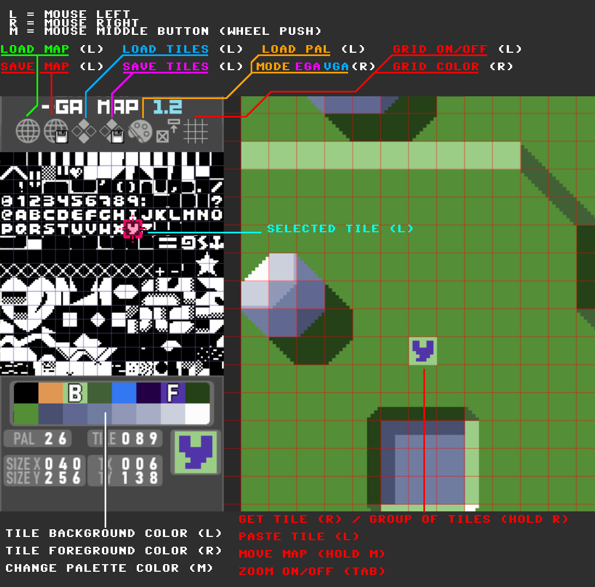

# Map editor for text mode
----------------------------------------------------------------------------

This is a map editor for CGA/TANDY/EGA/VGA 8x8 text modes. (16 colours, 2 colors per tile).

You can load a default CGA 8x8 font or any custom "tileset" for EEGA and VGA. To load a tileset, create a 1 bit png (2 colors), 128x128 pixels (containing 256 characters arranged from left to right, top to bottom), and save it with no compression or any other info in the header. For example using GIMP, disable everything when exporting, and set compression to 0.

To use on EGA/VGA, set text mode to use 8x8 cells, and disable blinking (to enable all 16 colours).

This will compile and work on windows, to use it on linux or mac, you'll have to figure out the OS functions to open/save files and create a color picker.
It should work on linux using a windows emulator like wine.

This program loads and saves maps using this format:
  - width x (2 bytes).
  - height y (2 bytes).
  - map in native CGA/TANDY/EGA/VGA video ram format: character ascii number (1 byte) + character color (1 byte) ...

This program also exports tilesets in raw 1 bit format, with characters arranged one after the other in the file (taken from left-right, top-bottom).

At the end of this readme you'll find a little manual to use the program.

# Editor de mapas para modos texto
----------------------------------------------------------------------------

Editor de mapas para el modo texto de CGA/TANDY/EGA/VGA. (16 colores, dos colores por celda).

Puedes usar el juego de caracteres (TILES) por defecto de CGA, pero si usas EGA o VGA, puedes cargar cualquier conjunto de caracteres. 
Para cargarlo, crea un archivo png de 1 bit (dos colores), de 128x128 pixeles, (conteniendo 256 caracteres ordenados de izquierda a derecha y de arriba a abajo) y guardalo sin compresion ni ningun otro dato en la cabecera. Por ejemplo en GIMP desactiva todas las casillas al guardar, y pon la compresión a 0.

Para usar los mapas en EGA/VGA, debes usar un modo texto con celdas de 8x8 y con parpadeo desactivado (que habilita los 16 colores).

De momento el programa compila y funciona en windows, si lo quieres usar en linux o mac, tendrás que sustituir las funciones de cargado y guardado de archivos del sistema y crear un seleccionador de colores. Es posible que funcione en linux con wine o similar. 

El programa carga y guarda mapas con este formato:
  - ancho x (2 bytes).
  - alto y (2 bytes).
  - mapa en formato nativo de memoria de video CGA/TANDY/EGA/VGA: número de caracter ascii (1 byte) + color de caracter (1 byte) ...

También puedes exportar juegos de caracteres en formato crudo de 1 bit, con los caracteres ordenados uno detras de otro en el archivo (tomados de izquierda a derecha y de arriba a abajo).

Debajo encontrarás una imagen explicando como usar el programa:
  - LOAD/SAVE = cargar/guardar.
  - L = Ratón click izquierdo.
  - R = Ratón click derecho.
  - M = Pulsar boton medio (rueda).
  - GRID = rejilla de ayuda.
  - BACKGROUND/FOREGROUND = color de fondo / color de caracter.

